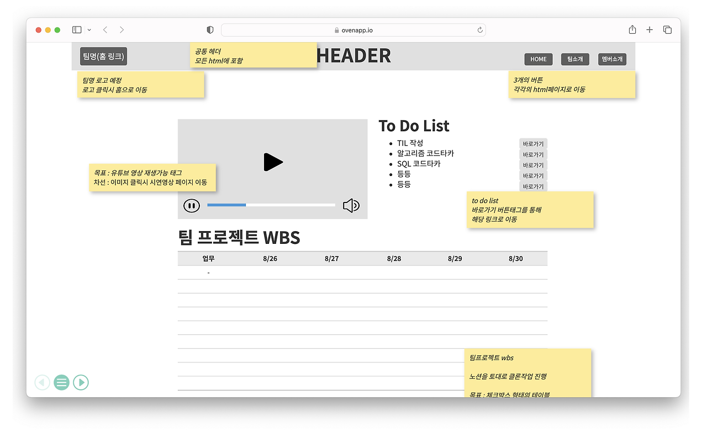
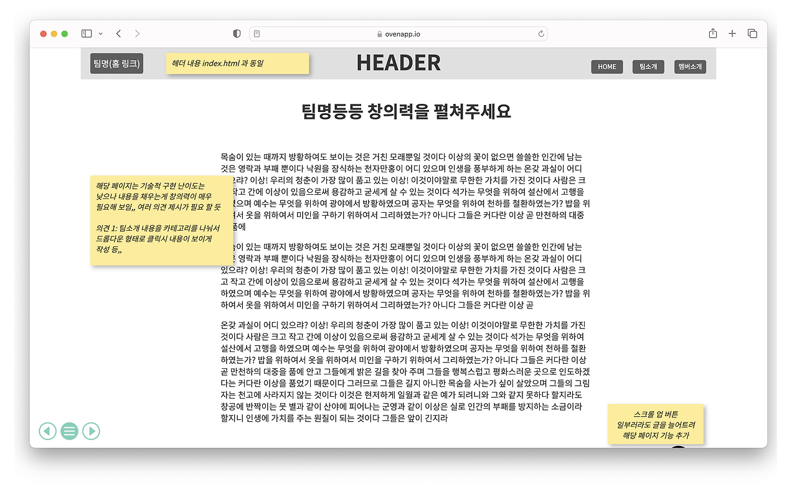
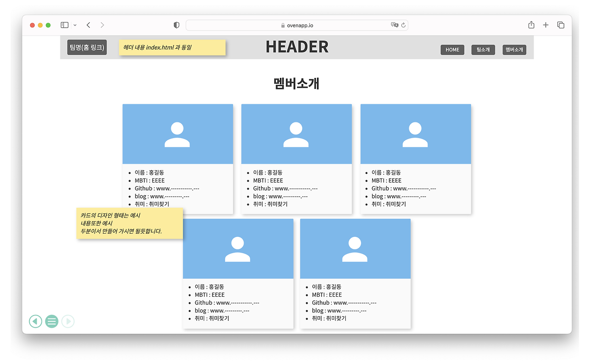

# 4 all fect 팀 소개 미니 프로젝트

## 프로젝트 소개
웹개발 종합반 강의를 통해 배운 HTML, CSS, Javascript 지식을 활용하여 팀 소개 웹 페이지를 만들어 보도록 합니다. 
팀 내부적으로 정한 프로젝트의 목표는 강의에서 배운 내용을 복습하는 것 뿐만 아니라 이를 응용해보고 상호 간 코드리뷰를 통해 견해를 넓혀 보는 것 입니다.

## 팀원 소개
<table>
    <thead>
        <tr>
            <th>팀원</th>
            <th>담당 페이지</th>
            <th>html</th>
            <th>구현 기능</th>
        </tr>
    </thead>
    <tbody>
        <tr>
            <td>김명훈</td>
            <td>메인 페이지</td>
            <td>home.html</td>
            <td>1.유튜브 소스코드 활용 시연 영상 웹사이트 내 위치 및 재생가능 
                2.open weather API 활용 실시간 서울 날씨 및 세부정보 확인 가능 
                3.To do List 에서 바로가기 버튼을 활용하여 링크연결 
                4.1주일간의 미니 프로젝트 wbs에 대한 table 설계</td>
        </tr>
        <tr>
            <td>허원경</td>
            <td>header, footer</td>
            <td>frame.html</td>
            <td>1. firebase로 비동기 api함수 사용하여 방문자수와 방문날짜를 firestore DB에 읽기 및 쓰기 구현. 
                2. localStorage 라는 브라우저 기본 스토리지 API를 이용하여 페이지의 방문날짜를 기록 및 쓰기 구현. 
                3. 부트스트랩을 활용하여 반응형 웹 디자인을 구현. 특히 헤더부분이 창 크기에 맞춰 유동적으로 변화하고, 991px 이하 환경에서는 방문자수를 제거하고 메뉴를 버튼화. 
                4. 부트스트랩에서 제공하는 유틸리티 클래스를 활용하여 스타일을 적용하였고, 이것만으로 어려운 스타일은 우선순위를 고려하여 커스텀 CSS를 적용.</td>
        </tr>
        <tr>
            <td>민지형</td>
            <td>팀 소개 페이지</td>
            <td>team.html</td>
            <td>1. alret과 모달을 사용하여 팀 소개 창 구현 
                2. 각 이미지에 페이드인 아웃효과를 추가</td>
        </tr>
        <tr>
            <td>박가온누리</td>
            <td>팀원 소개 페이지</td>
            <td>member.html</td>
            <td>1. Firebase SDK를 사용하여 Database에 데이터 Input/Output 구현 
                2. Firebase Blob Storage에 이미지를 업로드, 다운로드 URL 응답받는 기능 구현</td>
        </tr>
        <tr>
            <td>류지수</td>
            <td>팀원 소개 페이지</td>
            <td>member.html</td>
            <td>1. 멤버 카드 - 기본 디자인 설정, 카드를 클릭했을 때 효과와 그림자 효과 
                2. 모달 창을 구현해 멤버의 상세 정보를 표시 + 가독성을 높이기 위한 스타일링 적용 
                3. 모달 열기 및 닫기 기능 - openModal(index) 함수로 해당 멤버의 정보를 불러와서 화면에 표시. 창의 닫기 버튼을 클릭하거나 외부 영역 클릭 시 닫힘. 
                4. 멤버 데이터 관리: 멤버들의 정보를 특정 배열에 객체 형태로 저장 후 openModal 함수로 호출 
                5. GitHub 및 블로그 링크 동적 생성: 모달 창에서 GitHub 버튼 클릭 시 해당 멤버의 GitHub 페이지로 이동. 멤버의 블로그 유형에 따라 블로그 링크를 동적으로 생성하여 모달창에 구현. 유형에 따라 아이콘과 텍스트가 다르게 표시됨.</td>
        </tr>
    </tbody>
</table>

## 프로젝트 WBS

| 업무                       | 8/26(월) | 8/27(화) | 8/28(수) | 8/29(목) | 8/30(금) |
|--------------------------|---------|---------|---------|---------|---------|
| 팀 Github 생성             | ✅       |         |         |         |         |
| 웹 페이지에 들어갈 내용 구상  | ✅       |         |         |         |         |
| 와이어프레임 설계            | ✅       |         |         |         |         |
| 역할 분담                   | ✅       |         |         |         |         |
| 페이지 구성                 |         | ✅       | ✅       |         |         |
| 최종 코드 merge             |         |         | ✅       | ✅       |         |
| QA 테스트                  |         |         | ✅       | ✅       |         |
| 발표용 시연 영상 녹화        |         |         |         |         | ✅       |
| 결과물 제출 및 발표         |         |         |         |         | ✅       |

## 와이어프레임

### 1. HOME 페이지

### 2. 팀 소개 페이지

### 3. 팀원 소개 페이지

## 코드 Merge 전략
팀 용 Github Repository를 생성한 후 main을 제외하고 각 팀원별로 브랜치를 생성하였습니다. 
개발 기간 동안에는 팀원들이 각자의 브랜치에 코드를 push하여 기능 충돌을 방지하고 코드 공유를 활성화 했습니다. 

### 1. 기능 단위 병합
팀원들 간 페이지를 담당하여 기능을 구현하고 각 기능이 완료된 후, 테스트가 완료된 상태에서 병합을 진행했습니다. 

### 2. 결합 과정
- **코드 리뷰**: 매일 전날까지 작성한 코드를 보며, 어떤 문제가 발생했고 어떤 식으로 해결했는지 리뷰를 진행했습니다.
- **QA테스트**: merge를 진행한 후 각 구현한 기능들이 제대로 동작하는지 확인하는 과정을 거쳤습니다.
- **코드 Merge**: Github를 팀원 모두가 자유자재로 사용할 수 있는 것이 아닌 한 무지성적인 Merging은 위험하다는 판단 하에 1명이 담당하여 로컬에서 코드를 순차적으로 합쳐서 1차 QA테스트가 완료되면 main으로 push

## 시연 영상

## 4 all fect 팀원들의 블로그로 놀러오세요
<a href="https://a-new-s.tistory.com/" class="button-link" style="display:inline-block; padding:10px 20px; font-size:16px; color:black; background-color:#F5F5F5; text-align:center; text-decoration:none; border-radius:4px; border:none;">김명훈</a>
<a href="https://velog.io/@hwk__/posts" class="button-link" style="display:inline-block; padding:10px 20px; font-size:16px; color:black; background-color:#F5F5F5; text-align:center; text-decoration:none; border-radius:4px; border:none;">허원경</a>
<a href="https://velog.io/@mcbride317/posts" class="button-link" style="display:inline-block; padding:10px 20px; font-size:16px; color:black; background-color:#F5F5F5; text-align:center; text-decoration:none; border-radius:4px; border:none;">민지형</a>
<a href="https://worldcenter96.tistory.com/" class="button-link" style="display:inline-block; padding:10px 20px; font-size:16px; color:black; background-color:#F5F5F5; text-align:center; text-decoration:none; border-radius:4px; border:none;">박가온누리</a>
<a href="https://velog.io/@lilly2069/posts" class="button-link" style="display:inline-block; padding:10px 20px; font-size:16px; color:black; background-color:#F5F5F5; text-align:center; text-decoration:none; border-radius:4px; border:none;">류지수</a>